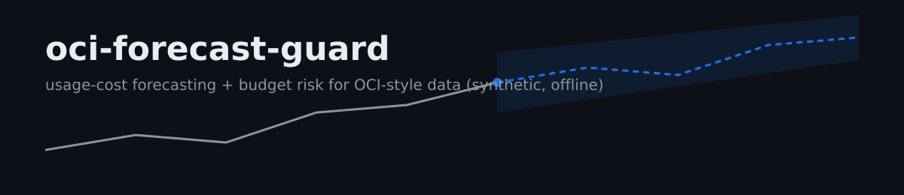
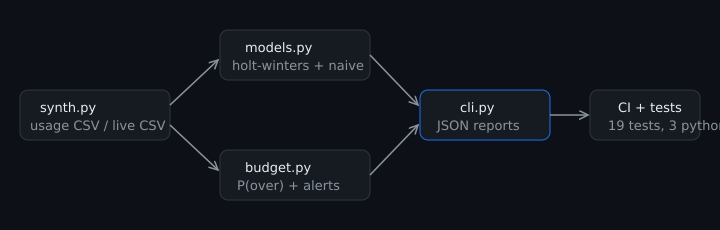

<p align="center">
  
</p>

# oci-forecast-guard

Offline usage-cost **forecasting and budget-risk assessment** shaped around
OCI Usage Report data. Holt-Winters exponential smoothing implemented from
first principles, evaluated against a seasonal-naive baseline on synthetic
usage series, with a probabilistic month-end budget risk report.

> **Portfolio notice.** This repository is an engineering portfolio project.
> All data is **synthetically generated** (deterministic seeds). It has
> **not** been run against a live OCI tenancy or real usage reports, and no
> accuracy claims are made beyond the reproducible evaluation below. To use
> it on real data, export an OCI Usage Report CSV with a `cost` column and
> pass `--csv`.

## What it does

- **Synthetic data generator** - daily cost series per service/compartment
  with trend, weekly seasonality, deterministic noise, and injectable
  anomalies (e.g. a surprise spend spike).
- **Holt-Winters additive forecasting** - level/trend/seasonality recursions
  implemented from scratch (no stats libraries), with residual-based
  prediction spread.
- **Honest evaluation** - every forecast self-reports MAE/MAPE against a
  seasonal-naive baseline on a holdout window, and the CLI states whether
  it beat the baseline. On the built-in synthetic fleet: **MAPE 2.5 vs 3.5
  (baseline)** on the compute series.
- **Budget risk** - given elapsed spend, forecast of remaining days, and
  residual spread, estimates P(over budget) with a Gaussian approximation
  and maps it to `ok / watch / warning / critical`.

## Quickstart

```bash
pip install -e .
python -m forecast_guard generate              # synthetic fleet CSV
python -m forecast_guard forecast --horizon 14 # forecast + eval vs baseline
python -m forecast_guard budget --budget 1500  # month-end risk report
```

Output of `budget` on the built-in synthetic series (day 20 of 30, budget 1500):

```json
{
  "spent_to_date": 833.16,
  "remaining_forecast": 439.34,
  "projected_total": 1272.5,
  "p_over_budget": 0.0,
  "alert_level": "ok",
  "days_remaining": 10
}
```

## Design

<p align="center">
  
</p>

| Module | Role |
| --- | --- |
| `synth.py` | Deterministic synthetic usage data (seeded hash noise) |
| `models.py` | Holt-Winters additive, seasonal-naive, MAE/MAPE |
| `budget.py` | Budget-risk probability and alert levels |
| `cli.py` | `generate` / `forecast` / `budget` commands |

## Tests and CI

19 unit tests cover determinism, anomaly injection, model quality
(forecast must beat the baseline on synthetic holdout), budget alert
thresholds, and CLI behaviour. CI runs the suite on Python 3.10-3.12
plus a smoke run of every CLI command.

## Roadmap

See the open issues: real OCI Usage Report CSV ingestion (FOCUS format)
and anomaly-aware retraining. Contributions welcome.

## License

MIT
